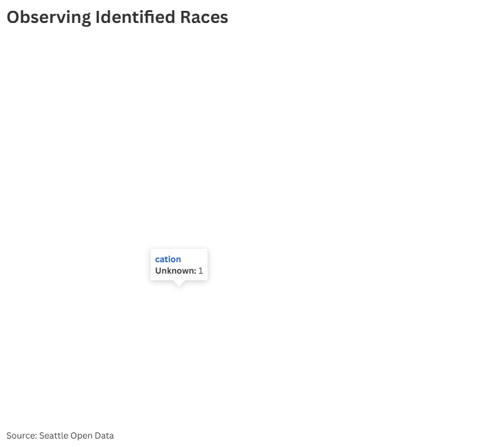

The data observed here highlights the fact that the data is missing certain races for offenders, but those races are present in officer race variable like hispanic and includng two or more races.

Data was collected via Seattle open data portal

https://app.flourish.studio/visualisation/28660384/edit
https://data.seattle.gov/Public-Safety/Seattle-Real-Time-Fire-911-Calls/kzjm-xkqj/about_data
